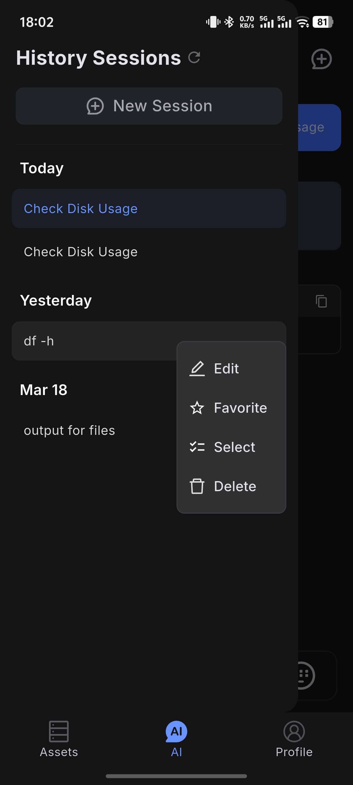
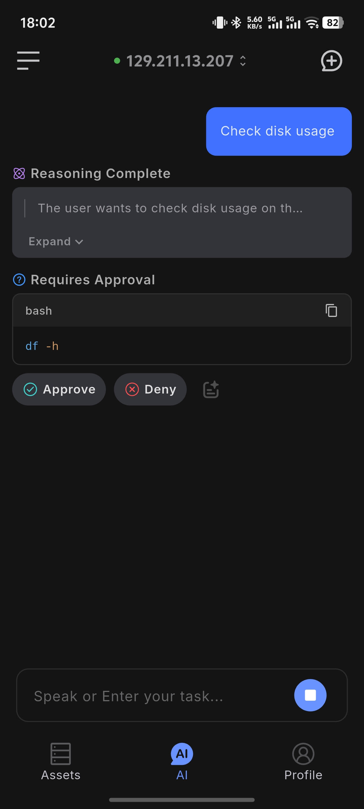
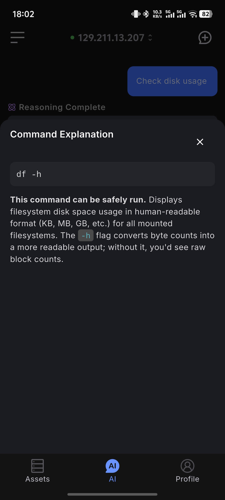
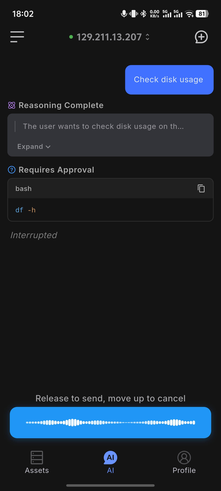
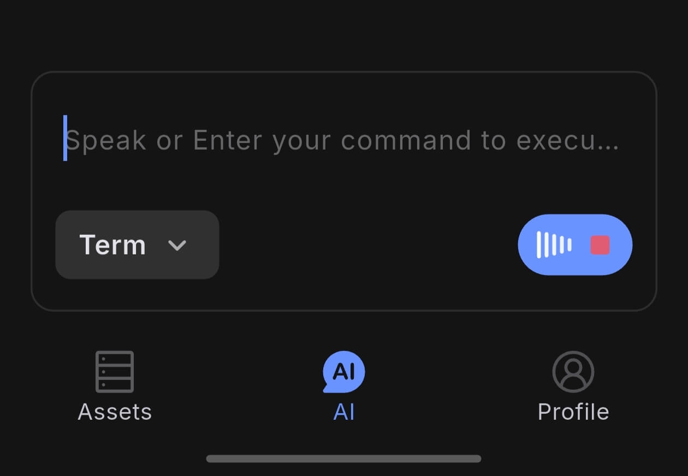

# AI Dialog

AI Session is a core capability of Chaterm's mobile app. It lets you handle server issues from your phone anytime, anywhere — not just executing commands, but with AI actively helping you think, troubleshoot, and make decisions.

Whether you receive an alert on the subway, need to debug urgently while traveling, or aren't sure how to write a command, you can describe the problem in plain language and let AI analyze, suggest, and execute. Voice input frees your hands further, and seamless switching between Terminal and Chat keeps context always connected.

The mobile app provides two main modes: `Chat` and `Term`. You can switch between them from the mode selector below the input box.

::: tip Prerequisites
Before using AI features (Chat mode, voice correction, command explanation), sign in and configure a model in [Profile > AI Settings > Model Selection](/docs/mobile/profile/#model-selection).
:::

  

## Chat Mode

`Chat` mode is designed for working with AI on analysis, explanations, and command suggestions.

Supports text and voice input. AI can parse natural language to generate commands and continue troubleshooting based on context.

Best for: learning Linux commands, troubleshooting, writing scripts, understanding configuration files, and reviewing operations best practices.

  

## Term Mode

`Term` mode directly executes commands without sending them through AI.

Connect to a server first. If no server is connected, the page shows an entry to connect a host. Supports text and voice input, and returns command output directly.

Best for: running a quick one-off command, checking host status fast.

  

## Context Sharing

A common pain point when troubleshooting on mobile: you run a command, see the output, want to ask AI what it means — but you have to manually select text, copy it, switch to the input box, and paste. On a small phone screen, this is tedious. Worse, if the output is long, it's nearly impossible to select it all.

Our solution is to have both modes share the same session context. Commands executed in Term mode and their output are directly visible to AI when you switch to Chat mode — no copy-paste needed.

**Typical scenario:**

1. In **Term mode**, run a command such as `journalctl -n 50` and see the log output
2. Switch to **Chat mode**
3. Type "Help me analyze the errors above"
4. AI analyzes the output directly without needing any copy-paste

This also applies to other scenarios, for example: run `df -h` and ask "Which partition is almost full?", or run your own script `xxx.js` and ask "What's the current task progress?".

::: tip
Switching modes does not clear the context. All terminal output from the current session is visible to AI.
:::

## History Sessions

Tap the icon in the upper-left corner to open the chat history sidebar and view all previous sessions. You can tap or long-press a session to perform more actions, such as favoriting sessions you find important.

### Actions:

- **Switch session**: tap any history entry to switch to that session
- **New session**: tap the new button at the top of the sidebar to start a fresh session
- **Edit title**: long-press a session entry and choose `Edit` to rename it
- **Favorite session**: long-press a session entry to favorite it; favorited sessions appear at the top of the list
- **Delete sessions**: long-press to enter multi-select mode and batch-delete history entries

  

## Command Approval

In `Chat` mode, AI pauses before executing a command and waits for your confirmation by default (approval mode). You can enable **Auto-execute** in [Profile > AI Preferences](/docs/mobile/profile/#ai-preferences) to let commands run without approval.

| Mode | Behavior |
|------|----------|
| **Approval mode** (default) | Pauses before each command and shows Approve / Reject buttons |
| **Auto-execute mode** | Commands run automatically without confirmation |

::: danger Danger
In auto-execute mode, AI may run multiple commands in succession without individual confirmation. Enable this only for familiar tasks or when you are confident about what the AI will do.
:::

  

## Command Explanation

In approval mode, when AI shows a pending command, you can tap the **Explain** icon to view command details — in addition to the Approve and Reject buttons.

**Button reference:**

| Button | Description |
|--------|-------------|
| **Approve** | Confirm and run the command |
| **Reject** | Cancel execution; AI stops the current task |
| **Explain** (document icon) | Opens a bottom panel where AI streams an explanation of the command |

**Explanation panel:**

After tapping the explain icon, the bottom sheet displays a step-by-step breakdown in real time, including:

- The overall purpose and safety of the command
- What each argument does
- Any potential side effects or caveats

Viewing an explanation does not trigger execution — you can safely review it before deciding to approve.

  

## Chat Voice Input

Both Chat and Term modes support voice input. Tap the microphone icon to the right of the input box to switch to voice input.

**How to use:**

1. Tap the microphone icon — the input box switches to a voice input button
2. **Long-press** the voice button to start recording; release to auto-transcribe
3. Slide up before releasing to cancel the recording
4. After transcription, the text is sent automatically (Chat mode)

  

## Voice Command Input

In **Term mode**, voice recognition results are automatically corrected by AI and filled into the input box. Through fine-tuning of our voice model, we achieve precise recognition of SRE domain commands, eliminating the need to type commands on a mobile keyboard. For example:

- Say "kube ctl get po" → auto-corrected to `kubectl get pods`
- Say "docker dash a" → auto-corrected to `docker ps -a`

  

## Typical Workflow

1. Open the AI dialog page
2. Connect to the target host
3. Choose `Chat` or `Term`
4. Enter a question or command, or start a request with voice input
5. Review the result and continue if needed

## Recommendations

- Use `Chat` mode first when you need explanation, planning, or troubleshooting
- Before running an unfamiliar command, tap **Explain** to understand what it does before approving
