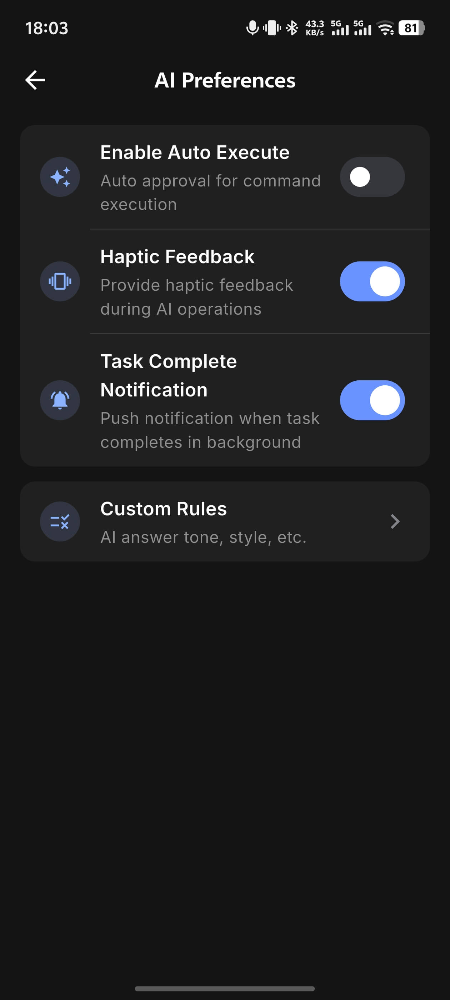
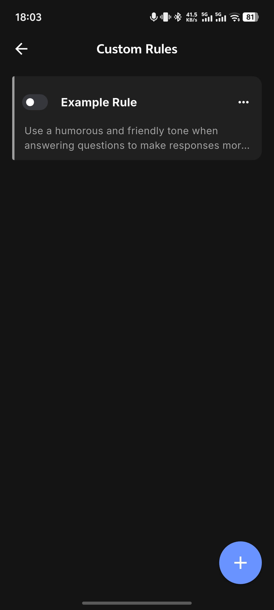

# Profile

Profile is where you manage account information, app settings, and AI-related preferences on mobile.

  

## Account

You can complete these actions here:

- View the current signed-in account
- Edit profile information
- Sign out
- Reset password
- Delete the account

  

## Security Center

Security Center provides signed-in device management.

- View all signed-in devices
- Remove untrusted devices

## App Settings

### Terminal

- KeepAlive heartbeat interval (default 15 seconds)
- Terminal execution timeout (default 60 seconds)

### Appearance and Language

- Theme: Light / Dark / Follow System
- Language: Simplified Chinese / English / Follow System
- Font size: Small / Standard / Large
- Message font size: independently adjust the font size for AI chat messages using a slider

## AI Settings

### Model Selection

After signing in, you can choose from the models currently available in the app.

### AI Preferences

- Auto-execute toggle
- Vibration feedback
- Task completion notifications

  

### Custom Rules

Set tone, style, and other personalized instructions for AI. Rules are appended to the system prompt for every conversation.

Go to **Custom Rules** → tap `+` in the lower-right corner to create a rule. Rules take effect immediately after saving. Each rule can be toggled on or off independently without deleting it.

**Example rules:**

- `Reply in English, be concise and direct, avoid over-explaining`
- `Briefly state the purpose before running any command`
- `Prefer kubectl over the k8s alias`

  

### Data Management

- **Data sync toggle**: when enabled, asset data and session data are encrypted and synced to the cloud, keeping all your devices in sync
- **Delete all conversation history**: clears all locally saved AI chat history
